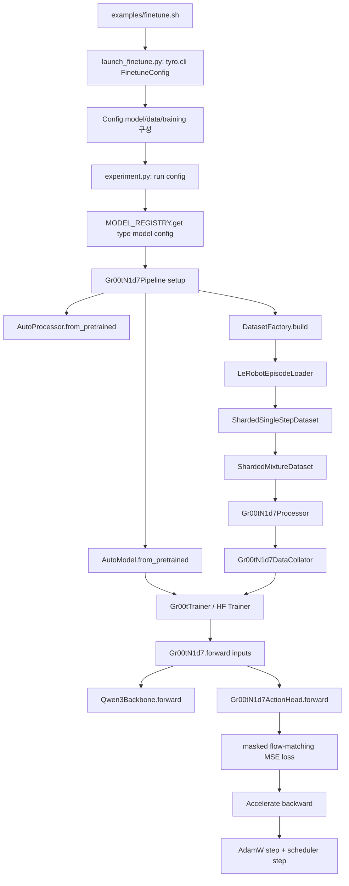
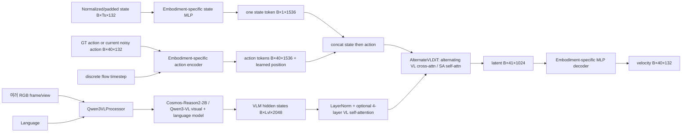
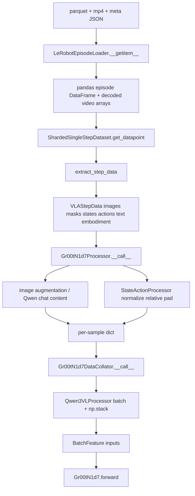
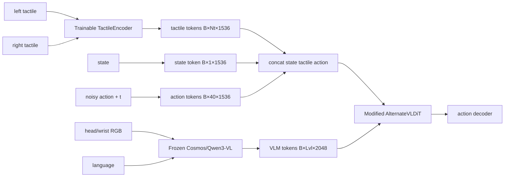

# GR00T N1.7 Code Analysis

> 분석 기준: 로컬 checkout `51d4c89f72fda44cbf77285c6a8114b52676b8a1`
> (`main`, commit date 2026-08-20). 코드 이름과 기본값은 이 revision을 기준으로 한다.
>
> 이 문서에서 **소스 기본값**은 새 `Gr00tN1d7Config()`를 만들 때의 값이고,
> **공개 base checkpoint 값**은 fine-tuning이 실제로 읽는
> [`nvidia/GR00T-N1.7-3B`의 `config.json`](https://huggingface.co/nvidia/GR00T-N1.7-3B/blob/main/config.json)을 뜻한다.
> 두 값은 같지 않다. 특히 Action DiT는 소스 기본값 16층이지만 공개 checkpoint는 32층이다.

## 0. 분석 방법, 검증 범위, 주의점

이 문서는 README나 논문 구조를 출발점으로 삼지 않았다. 다음 순서로 실제 구현을 추적했다.

1. fine-tuning shell entry point부터 Hugging Face `Trainer`의 loss 호출까지 따라갔다.
2. `VLAStepData`가 만들어지는 지점부터 processor/collator/model 입력까지 따라갔다.
3. `Gr00tN1d7`, `Qwen3Backbone`, `Gr00tN1d7ActionHead`, `AlternateVLDiT`의
   실제 `forward()`를 따라 shape를 재구성했다.
4. 공개 checkpoint의 config/index와 로컬 module 정의를 이용해 meta device에서 parameter를
   instantiate하여 component별 parameter 수를 계산했다.
5. 축소한 동일 구조의 Action Head에 대해 CPU forward/backward와 4-step inference를 실행해
   loss 및 출력 shape가 유한한지 확인했다.

실행 환경에는 완전한 checkpoint와 사용 가능한 CUDA driver가 없었다. `nvidia-smi`는 driver와
통신하지 못했고 checkpoint도 로컬 cache에 없었으므로, 실제 RTX 3090 peak VRAM과 full-model
forward는 측정하지 못했다. parameter count는 weight를 할당하지 않는 meta-device 구성으로
검증했으며, shape는 코드와 작은 실행을 함께 사용했다. 분석을 위해 별도 영구 script는 만들지
않았다. `/tmp/gr00t-analysis-deps`에 `transformers==4.57.3`, `diffusers==0.35.1`,
`dm-tree`, `tyro`를 임시 설치하고 inline Python만 사용했다. repository에서 수정한 것은 이 문서뿐이다.

---

## 1. Repository Overview

### 1.1 중요한 디렉터리와 파일

```text
repo/
├── examples/
│   ├── finetune.sh                         # 공식 fine-tuning CLI wrapper
│   ├── SO100/so100_config.py              # custom modality config의 가장 작은 예
│   ├── DROID/, LIBERO/, SimplerEnv/ ...   # embodiment/simulator별 실행 예
│   └── mask-guided-background-suppression/# processor augmentation 확장 예
├── gr00t/
│   ├── configs/
│   │   ├── base_config.py                 # 최상위 Config와 YAML I/O, DeepSpeed config
│   │   ├── finetune_config.py             # tyro가 읽는 사용자-facing CLI dataclass
│   │   ├── model/gr00t_n1d7.py            # 모델/Action Head/flow 설정
│   │   ├── data/data_config.py            # dataset path, weight, embodiment 설정
│   │   ├── data/embodiment_configs.py     # modality registry와 기본 embodiment schema
│   │   └── training/training_config.py    # batch/LR/epoch/checkpoint/precision
│   ├── data/
│   │   ├── types.py                       # VLAStepData 등 모델 전 단계의 canonical record
│   │   ├── dataset/factory.py             # dataset 생성 진입점
│   │   ├── dataset/lerobot_episode_loader.py
│   │   │                                   # LeRobot parquet/video/meta reader
│   │   ├── dataset/sharded_single_step_dataset.py
│   │   │                                   # episode→시간 window→VLAStepData
│   │   ├── dataset/sharded_mixture_dataset.py
│   │   │                                   # multi-dataset mixing/prefetch/IterableDataset
│   │   ├── state_action/state_action_processor.py
│   │   │                                   # normalization, relative action, padding
│   │   └── dataset/*.py                   # stats 생성, sharding 기반 클래스
│   ├── experiment/
│   │   ├── launch_finetune.py             # fine-tune CLI→Config 변환
│   │   ├── experiment.py                  # pipeline/Trainer 생성과 train() 호출
│   │   ├── trainer.py                     # Gr00tTrainer, prefetch, metric logging
│   │   └── utils.py                       # checkpoint callback
│   ├── model/
│   │   ├── registry.py                    # model-config type→pipeline registry
│   │   ├── base/model_pipeline.py         # pipeline interface
│   │   ├── gr00t_n1d7/setup.py            # N1.7 model/processor/dataset 조립
│   │   ├── gr00t_n1d7/gr00t_n1d7.py       # 전체 model과 Action Head
│   │   ├── gr00t_n1d7/processing_gr00t_n1d7.py
│   │   │                                   # image/text/state/action processor+collator
│   │   ├── gr00t_n1d7/image_augmentations.py
│   │   └── modules/
│   │       ├── qwen3_backbone.py           # Cosmos/Qwen3-VL wrapper와 freeze 정책
│   │       ├── dit.py                      # DiT, alternating VL attention, AdaLN
│   │       └── embodiment_conditioned_mlp.py
│   │                                           # state/action encoder/decoder
│   ├── policy/
│   │   ├── gr00t_policy.py                 # raw observation→processor→model inference
│   │   ├── server_client.py                # ZeroMQ/msgpack RPC
│   │   └── base_policy.py
│   ├── eval/
│   │   ├── run_gr00t_server.py             # inference server CLI
│   │   ├── sim/                            # simulator별 evaluator
│   │   └── real_robot/                     # real robot adapters
│   └── deployment/                         # inference/deployment helpers
├── scripts/
│   ├── deployment/                         # ONNX/TRT export, benchmark, platform install
│   ├── lerobot_conversion/                 # 외부 dataset→LeRobot schema 변환
│   ├── eval/                               # evaluation launch helpers
│   └── validate_hf_config_alignment.py     # source config와 HF artifact 검증
├── demo_data/                              # 작은 LeRobot-format examples
├── getting_started/                        # 사용 설명서; core 구현은 아님
├── tests/                                  # CPU/GPU, dataset, model, deployment tests
├── external_dependencies/                  # simulator git submodules; core train에는 불필요
├── pyproject.toml                          # Python 3.12, uv, dependencies, ruff/pytest
└── uv.lock                                 # 재현 가능한 dependency lock
```

### 1.2 핵심도와 실제 사용 관계

| 영역 | 학습에서 사용 | 추론에서 사용 | 중요도 | 직접 연결되는 핵심 |
|---|---:|---:|---|---|
| `configs/` | 예 | 예 | 핵심 | `launch_finetune` → `Config`; HF checkpoint config |
| `data/dataset/` | 예 | 아니오 | 핵심 | loader → sharded dataset → processor |
| `processing_gr00t_n1d7.py` | 예 | 예 | 핵심 | data와 Qwen processor/model 사이 계약 |
| `gr00t_n1d7.py` | 예 | 예 | 최핵심 | backbone output → Action Head → loss/action |
| `qwen3_backbone.py` | 예 | 예 | 최핵심 | Cosmos/Qwen3-VL 호출, layer truncation, freeze |
| `dit.py` | 예 | 예 | 최핵심 | flow velocity network |
| `embodiment_conditioned_mlp.py` | 예 | 예 | 최핵심 | state/action encoding과 action decoding |
| `experiment/` | 예 | 아니오 | 핵심 | Trainer와 optimizer/backward orchestration |
| `policy/` | 아니오 | 예 | 핵심 | online observation/action API |
| `scripts/deployment/` | 아니오 | 배포 시 | 보조/플랫폼 핵심 | ONNX/TensorRT/benchmark |
| `eval/`, `examples/` | 간접 | 예 | 보조 | 사용 사례와 simulator adapter |
| `tests/` | 검증 | 검증 | 매우 유용 | shape/API의 executable specification |

`gr00t/model/gr00t_n1d7/__init__.py`와 `gr00t/model/__init__.py`의 import side effect는
HF `AutoConfig`/`AutoModel`/`AutoProcessor` 및 내부 `MODEL_REGISTRY`가 N1.7 타입을 찾게 한다.
즉 파일을 직접 new하는 것보다 registry를 통해 checkpoint에서 객체를 복원하는 경로가 정상 경로다.

---

## 2. Training Pipeline

### 2.1 전체 call graph



### 2.2 단계별 추적

#### 1) command와 shell wrapper

- 파일: `examples/finetune.sh`
- 역할: `--base-model-path`, `--dataset-path`, `--embodiment-tag`, `--output-dir` 등을
  파싱해 `gr00t/experiment/launch_finetune.py` 인자로 바꾼다.
- 단일 GPU: 일반 `python` 실행. 다중 GPU: `torchrun` 실행.
- 이 파일은 model을 직접 만들지 않는다.

#### 2) CLI와 config loading

- 파일/함수: `gr00t/experiment/launch_finetune.py:load_modality_config()`, module main body
- 호출: shell 또는 직접 Python 실행.
- 입력: `tyro.cli(FinetuneConfig)`가 만든 `FinetuneConfig`.
- 출력: nested `Config(model, data, training)`를 만든 뒤 `experiment.run(config)` 호출.
- 중요한 변환:
  - 문자열 embodiment를 `EmbodimentTag`로 resolve한다.
  - `--modality-config-path`가 있으면 Python 파일을 import해 custom modality config를 얻는다.
  - `start_from_checkpoint = base_model_path`로 둔다.
  - fine-tuning recipe가 `model_name="nvidia/Cosmos-Reason2-2B"`,
    `reproject_vision=False`, `load_bf16=False`, `backbone_trainable_params_fp32=True`,
    `use_relative_action=True`, `optim="adamw_torch"`를 명시적으로 정한다.

여기서 중요한 점은 architecture layer 수 같은 값은 새 source default보다
`start_from_checkpoint`의 HF config에서 복원된다는 것이다.

#### 3) experiment 조립

- 파일/함수: `gr00t/experiment/experiment.py:run(config)`
- 호출자: `launch_finetune.py`.
- 입력: `Config`.
- 출력: side effect로 학습/checkpoint 저장; 함수 내부에는 model, dataset, trainer가 만들어진다.
- 동작:
  1. config 검증, logging/distributed seed 설정.
  2. `MODEL_REGISTRY.get(type(config.model))`로 `Gr00tN1d7Pipeline` 선택.
  3. `pipeline.setup()` 호출.
  4. HF `TrainingArguments` 생성. batch size, grad accumulation, BF16, LR, scheduler,
     DeepSpeed, gradient checkpointing, dataloader worker 등이 들어간다.
  5. `Gr00tTrainer(...).train(resume_from_checkpoint=...)` 호출.

`OmegaConf`는 이 과정에서 객체 생성을 지배하지 않는다. 실행 config artifact인 `conf.yaml`을
쓰기 위해서만 쓰인다.

#### 4) model/checkpoint 생성과 freeze

- 파일/클래스: `gr00t/model/gr00t_n1d7/setup.py:Gr00tN1d7Pipeline`
- 함수: `setup()`, `_create_model()`, `_create_dataset()`, `_create_collator()`.
- 호출자: `experiment.run()`.
- checkpoint 경로가 있을 때 핵심 호출:

```python
AutoModel.from_pretrained(
    start_from_checkpoint,
    tune_llm=...,
    tune_visual=...,
    tune_projector=...,
    tune_diffusion_model=...,
    tune_vlln=...,
    state_dropout_prob=...,
    output_loading_info=True,
)
```

`output_loading_info`의 missing/unexpected/mismatched key를 검사하므로 checkpoint와 코드가
조용히 어긋나는 것을 막는다. `Gr00tN1d7.__init__()`은 `Qwen3Backbone`과
`Gr00tN1d7ActionHead`를 만든다. 각 module의 `set_trainable_parameters()`가
`requires_grad`와 frozen module의 eval mode를 관리한다.

#### 5) dataset 생성과 preprocessing

- `DatasetFactory.build()`가 dataset별 statistics를 만들거나 읽고,
  `ShardedSingleStepDataset`들을 만든 후 `ShardedMixtureDataset`으로 합친다.
- `ShardedSingleStepDataset.get_datapoint()`가 한 episode의 현재 시점과 delta indices로
  image/state/action/language window를 뽑아 `VLAStepData`를 만든다.
- 같은 함수가 `Gr00tN1d7Processor.__call__()`을 호출해 model-ready record로 바꾼다.
- dataloader의 `Gr00tN1d7DataCollator.__call__()`가 여러 record를 batch tensor로 합친다.

대표적인 collated 입력은 다음과 같다.

```text
inputs.vlm_content.input_ids        [B, L_vl]
inputs.vlm_content.attention_mask   [B, L_vl]
inputs.vlm_content.pixel_values     [sum(raw vision patches), 1536]
inputs.vlm_content.image_grid_thw   [sum(images), 3]
inputs.state                        [B, T_s, 132]
inputs.action                       [B, 40, 132]
inputs.action_mask                  [B, 40, 132]
inputs.embodiment_id                [B]
```

`pixel_values`는 일반적인 `[B,C,H,W]`를 유지하지 않는다. Qwen processor가 이미 temporal/spatial
patch를 펴서 만든 flattened patch records다.

#### 6) forward와 loss

- 파일/함수: `gr00t/model/gr00t_n1d7/gr00t_n1d7.py:Gr00tN1d7.forward()`.
- 호출자: HF `Trainer.compute_loss()`가 `model(**batch)` 형태로 호출한다. collator가 바깥 key를
  `inputs`로 만들었기 때문에 signature와 맞는다.
- 내부:

```text
Gr00tN1d7.forward(inputs)
├── prepare_input(inputs)
├── Qwen3Backbone.forward(vl_input)
│   └── Qwen3VLForConditionalGeneration(..., output_hidden_states=True)
└── Gr00tN1d7ActionHead.forward(backbone_output, action_input)
    ├── process_backbone_output()
    ├── state_encoder()
    ├── noise/time sampling + interpolation
    ├── action_encoder()
    ├── AlternateVLDiT.forward()
    ├── action_decoder()
    └── masked MSE → {loss, action_loss, ...}
```

`loss`는 scalar, `action_loss`는 `[B,40,132]`이다. 정확히는
`gr00t/experiment/trainer.py:Gr00tTrainer.compute_loss()`가 먼저 호출되고, 이 함수가
`super().compute_loss(..., return_outputs=True)`에 model 호출을 위임한다. N1.7 batch에는
token-classification용 `labels`가 없으므로 이 subclass의 optional accuracy branch는 실행되지 않고,
Action Head가 반환한 scalar `loss`가 그대로 backward 대상이 된다.

#### 7) backward, optimizer, scheduler

repository에 수동 `loss.backward()` loop가 있는 것이 아니다. `Gr00tTrainer`는 Hugging Face
`Trainer`를 상속하고 dataloader/prefetch/logging을 주로 수정한다. loss dict의 `loss`를 HF
Trainer/Accelerate가 backward하고, `TrainingArguments`의 `optim="adamw_torch"`, LR,
weight decay, warmup/scheduler에 따라 optimizer와 scheduler를 step한다. gradient accumulation이
1보다 크면 그 횟수만큼 microbatch를 누적한 뒤 optimizer step을 한다.

---

## 3. Overall Architecture

### 3.1 실제 code-level data flow



GR00T 쪽에 별도의 “vision projector”나 “multimodal fusion projector” module은 없다.
Qwen3-VL 내부 visual patch merger가 vision width 1024를 language width 2048로 바꾸고 visual
embedding을 image placeholder 위치에 넣는다. GR00T가 `backbone_embedding_dim=2048` hidden
state를 받은 뒤 Action Head cross-attention의 K/V로 사용한다.

### 3.2 PyTorch module hierarchy

```text
Gr00tN1d7
├── backbone: Qwen3Backbone
│   └── model: Qwen3VLForConditionalGeneration
│       └── model: Qwen3VLModel
│           ├── visual: Qwen3VLVisionModel
│           │   ├── patch_embed
│           │   ├── blocks × 24
│           │   ├── merger
│           │   └── deepstack_merger_list
│           └── language_model: Qwen3VLTextModel
│               ├── embed_tokens
│               ├── layers × select_layer (checkpoint: 16 retained)
│               ├── norm
│               └── rotary_emb
└── action_head: Gr00tN1d7ActionHead
    ├── vlln: LayerNorm(2048)
    ├── vl_self_attention: SelfAttentionTransformer (checkpoint: 4 blocks)
    ├── state_encoder: CategorySpecificMLP
    ├── action_encoder: MultiEmbodimentActionEncoder
    ├── position_embedding: Embedding(1024,1536)
    ├── model: AlternateVLDiT (checkpoint: 32 blocks)
    │   ├── timestep_encoder
    │   ├── transformer_blocks
    │   ├── norm_out
    │   └── proj_out (1536→1024)
    └── action_decoder: CategorySpecificMLP (1024→132)
```

### 3.3 주요 dimension과 layer

| Component | 공개 base checkpoint에서 확인한 값 | normalization/activation/attention |
|---|---|---|
| Qwen text | hidden 2048, original 28층 중 16층 유지, Q heads 16, KV heads 8, head dim 128, FFN 6144 | RMSNorm, SwiGLU/SiLU, causal GQA, MRoPE |
| Qwen vision | hidden 1024, 24 blocks, 16 heads, head dim 64, FFN 4096 | LayerNorm, GELU-tanh, full vision SA, 2D RoPE + positional embedding |
| vision patch | spatial patch 16, temporal patch 2, spatial merge 2 | merger output 2048 |
| VL post-net | 4 blocks, hidden 2048, 32 heads × 64 | LayerNorm, bidirectional SA, GELU FFN |
| state token | `[T_s×132]→1024→1536`, 32 embodiment banks | ReLU |
| action token | `132→1536`; timestep 1536; concat→1536→1536 | sinusoidal time, swish |
| Action DiT | hidden 1536, 32 blocks, 32 heads × 48, output 1024 | AdaLN on attention, GELU FFN, alternating cross/self |
| decoder | `1024→1024→132`, 32 embodiment banks | ReLU |

Qwen architecture 수치는 이 repo가 호출하는 exact class의 official base config와 구현에서 확인했다.
Cosmos artifact는 gated일 수 있으므로, [`Qwen3-VL-2B-Instruct config`](https://huggingface.co/Qwen/Qwen3-VL-2B-Instruct/blob/main/config.json)와
[`Cosmos-Reason2-2B model card`](https://huggingface.co/nvidia/Cosmos-Reason2-2B)를 함께 대조했다.
아래 parameter 합이 N1.7 checkpoint 총합과 정확히 맞는 것도 dimension 검증 근거다.

### 3.4 Backbone의 중요한 구현 세부

`Qwen3Backbone.__init__()`은 `Qwen3VLForConditionalGeneration.from_pretrained(model_name)`을
호출한 뒤 다음을 수행한다.

- `language_model.layers`의 길이가 `select_layer`가 될 때까지 뒤에서 `pop()`한다.
  따라서 `select_layer`는 “어느 hidden state를 선택할지”만 뜻하지 않고, 실제로 상위 layer를
  제거해 메모리/compute를 줄이는 retained layer 수다.
- `forward()`는 `output_hidden_states=True`로 실행하고 `hidden_states[-1]`을
  `backbone_features [B,L_vl,2048]`로 반환한다.
- `image_mask = input_ids == image_token_id`를 만들어 Action DiT가 image token과 나머지 token을
  서로 다른 cross-attention block에서 볼 수 있게 한다.
- `backbone_attention_mask`는 padding mask다.
- `tune_llm=False`이면 language model, `tune_visual=False`이면 visual model을 freeze한다.
  frozen module은 매 학습 step의 `.train()` 호출 뒤에도 다시 `.eval()`로 둔다.
- FlashAttention import가 실패하면 SDPA로 fallback한다.
- `reproject_vision`/`projector_dim`에 해당하는 별도 GR00T projector는 현재 Qwen wrapper에 없다.

Qwen vision은 image를 patch embedding→24 vision blocks→patch merger로 처리한다. temporal patch가
2이므로 정지 image는 processor가 필요한 temporal 형태를 구성한다. spatial merge 2 때문에
`256×256`이 그대로 유지된다는 조건에서 image 하나는 raw grid `16×16=256` patch record,
VLM sequence에는 약 `8×8=64` visual token으로 들어간다. exact token 수는 Qwen image processor의
resize/padding과 frame grouping에 따라 달라지므로 `image_grid_thw`를 실제 batch에서 확인해야 한다.

Language model 내부 attention은 causal이지만, image token이 user message의 language token과 같은
Qwen multimodal sequence에 주입되므로 16개 retained layer에서 융합된다. Qwen3-VL은 MRoPE를
사용하며 visual positional structure와 text positions를 함께 다룬다. GR00T는 generation을 하지
않고 hidden state만 사용하며 `past_key_values`를 전달하지 않으므로 KV cache를 사용하지 않는다.

---

## 4. Vision-Language Backbone

### 4.1 입력과 출력

`Gr00tN1d7DataCollator`가 `Qwen3VLProcessor`를 통해 다음을 만든다.

| tensor | 의미 | shape |
|---|---|---|
| `input_ids` | chat template를 적용한 language+image placeholders | `[B,L_vl]` |
| `attention_mask` | 왼쪽 padding 포함 valid token mask | `[B,L_vl]` |
| `pixel_values` | flattened raw visual patch records | `[P_total, 3×2×16×16=1536]` |
| `image_grid_thw` | image별 temporal/height/width patch grid | `[N_images_total,3]` |

`Qwen3Backbone.prepare_input()`은 backbone이 쓰는 이 네 key만 선택한다. 출력은 다음이다.

```text
backbone_features       [B,L_vl,2048]
backbone_attention_mask [B,L_vl] bool/int mask
image_mask              [B,L_vl] bool
```

### 4.2 fusion과 projector의 정확한 위치

1. Qwen visual encoder가 visual patch를 1024-dimensional feature로 만든다.
2. Qwen visual merger가 spatial `2×2` patch group을 합쳐 2048-dimensional token을 만든다.
3. Qwen model이 `input_ids`의 image placeholder 위치를 visual embedding으로 `masked_scatter`한다.
4. language decoder layers가 mixed sequence를 causal self-attention으로 처리한다.
5. GR00T Action Head의 `vlln`과 optional `vl_self_attention`이 hidden states를 후처리한다.
6. Action DiT cross-attention에서 action/state query가 이 2048-dimensional sequence를 읽는다.

따라서 이 구현에서 “projector”라는 말은 세 가지를 구별해야 한다.

- Qwen 내부 vision merger/projector: backbone 일부이며 `tune_visual`의 영향을 받는다.
- N1.7 Action Head의 state/action encoder/decoder: CLI/config에서 역사적으로
  `tune_projector`라 부른다.
- `reproject_vision`: 현재 wrapper에는 대응하는 학습 module이 없어 tactile 설계에서 믿고
  사용할 extension point가 아니다.

---

## 5. Action Head

이 절은 연구 목적상 가장 상세히 읽어야 할 부분이다.

### 5.1 모든 입력

`Gr00tN1d7ActionHead.forward(backbone_output, action_input)`의 실제 입력은 다음과 같다.

| 이름 | 생성 위치 | shape | 용도 |
|---|---|---|---|
| `backbone_features` | `Qwen3Backbone.forward()` | `[B,L_vl,2048]` | cross-attention K/V |
| `backbone_attention_mask` | Qwen collator/backbone | `[B,L_vl]` | padding VL token 차단 |
| `image_mask` | `input_ids == image_token_id` | `[B,L_vl]` | image vs non-image cross-attn 분리 |
| `state` | `StateActionProcessor`+collator | `[B,T_s,132]` | state token 생성 |
| `action` | processor가 normalize/pad한 GT | `[B,40,132]` | training의 data endpoint `x_1` |
| `action_mask` | processor | `[B,40,132]` | 실제 horizon/dimension만 loss 반영 |
| `embodiment_id` | processor의 tag mapping | `[B]` | category-specific weight bank 선택 |
| `noise` | Action Head 내부 `randn_like` | `[B,40,132]` | base endpoint `x_0` |
| continuous `t` | `sample_time()` | `[B,1,1]` | interpolation |
| bucket timestep | `long(t×1000)` | `[B]` | action encoder와 DiT conditioning |

Embodiment는 별도 token이나 learned embedding으로 넣지 않는다. 각 sample의 integer ID로
`CategorySpecificLinear` weight bank의 어느 matrix를 쓸지 선택한다.

### 5.2 VLM feature post-processing

`process_backbone_output()`은 다음을 적용한다.

```text
[B,L_vl,2048]
  → LayerNorm(2048)       # use_vlln=True
  → SelfAttentionTransformer
  → [B,L_vl,2048]
```

공개 checkpoint의 `vl_self_attention_cfg`에는 4 blocks, 32 heads, head dim 64가 들어 있다.
각 block은 plain LayerNorm→bidirectional self-attention→residual→LayerNorm→GELU FFN→residual이다.
주의할 점은 `process_backbone_output()`이 이 transformer에 padding attention mask를 넘기지 않는다는
것이다. 뒤의 cross-attention에는 `backbone_attention_mask`가 전달되지만 이 4-layer post-net 자체는
padding token도 self-attend할 수 있다. source default에는 `vl_self_attention_cfg` 자체가 없어
`nn.Identity`가 된다.

### 5.3 State encoding

파일은 `gr00t/model/modules/embodiment_conditioned_mlp.py`, 클래스는
`CategorySpecificMLP`다. Action Head는 state history를 먼저 편다.

$$
S\in\mathbb{R}^{B\times T_s\times132}
\quad\rightarrow\quad
\bar S\in\mathbb{R}^{B\times1\times(132T_s)}.
$$

embodiment ID가 $e_b$인 sample에 대해:

$$
h_s^{(b)} = W^{s,2}_{e_b}\,
\operatorname{ReLU}(W^{s,1}_{e_b}\bar s_b+b^{s,1}_{e_b})+b^{s,2}_{e_b}.
$$

shape는 공개 checkpoint/default 모두 다음과 같다.

```text
state               [B,T_s,132]    (default T_s=1)
flatten/view         [B,1,132*T_s]
category linear 1   [B,1,1024]
ReLU
category linear 2   [B,1,1536]
state_features      [B,1,1536]
```

`CategorySpecificLinear`은 32 embodiment 각각에 독립 weight/bias를 보관한다. 따라서 새 UniVTAC
embodiment가 어떤 ID에 map되는지 안정적으로 고정해야 한다.

Training에서는 두 군데 state dropout이 존재한다.

1. processor가 normalized raw state를 확률적으로 0으로 만들 수 있다.
2. Action Head가 encoded `state_features` 전체를 sample 단위로 다시 0으로 만들 수 있다.

두 적용이 독립이고 모두 $p=0.2$라면 state가 살아남을 확률은 약 $0.8^2=0.64$다. 현재 코드를
수정할 때 의도한 중복인지 확인해야 한다. config source default는 `0.8`, fine-tune CLI default는
`0.2`를 override한다.

### 5.4 Action encoding

파일/클래스는 `MultiEmbodimentActionEncoder`다. noisy action chunk
$X_t\in\mathbb{R}^{B\times H\times132}$의 각 time position을 하나의 token으로 바꾼다.

먼저 embodiment-specific linear:

$$
z_a = W^{a,1}_{e}X_t+b^{a,1}_{e},
\qquad z_a\in\mathbb{R}^{B\times H\times1536}.
$$

bucketized timestep $k\in\{0,\dots,999\}$를 sinusoidal encoding해
$z_t\in\mathbb{R}^{B\times1536}$로 만들고 horizon에 broadcast한다. 이후:

$$
h_a = W^{a,3}_{e}\,
\operatorname{swish}\!\left(
W^{a,2}_{e}[z_a;z_t]+b^{a,2}_{e}
\right)+b^{a,3}_{e}.
$$

```text
noisy action       [B,H,132]
W1                 [B,H,1536]
time sinusoid      [B,1536] → [B,H,1536]
concat             [B,H,3072]
W2 + swish         [B,H,1536]
W3                 [B,H,1536]
+ learned pos[0:H] [B,H,1536]
```

Action encoder는 temporal convolution이나 별도 transformer가 아니다. 각 action step에 동일한
형식의 MLP를 적용하고, step 간 상호작용은 뒤의 DiT self-attention이 담당한다. learned position
embedding은 action token에만 더해지고 state token에는 더해지지 않는다.

### 5.5 State/action sequence와 decoder

```python
sa_embs = torch.cat((state_features, action_features), dim=1)
```

따라서 default $T_s=1,H=40$이면 `[B,41,1536]`이다. DiT는 이를 `[B,41,1024]`로 출력한다.
`CategorySpecificMLP(1024→1024→132)` decoder가 모든 41 token을 decode한 뒤,
`pred[:, -actions.shape[1]:]`로 마지막 40개만 선택한다.

$$
\hat v = W^{d,2}_{e}\operatorname{ReLU}(W^{d,1}_{e}h+b^{d,1}_{e})+b^{d,2}_{e}.
$$

별도의 post-processing “Action decoder transformer”는 없다. 이 MLP 출력은 normalized action
space의 velocity이며, inference integration이 끝난 다음 processor의 `decode_action()`이
normalization과 relative-action transform을 역변환한다.

### 5.6 구현상 주의할 padding 효과

실제 action dimension/horizon 밖은 `action_mask=0`이므로 직접 loss에는 포함되지 않는다. 그러나
noise/interpolation/action encoder/DiT에는 padded `[40,132]` 전체가 들어간다. 즉 padded 위치의
noise token이 self-attention을 통해 valid token에 간접 영향을 줄 수 있다. DiT self-attention에는
별도 action padding mask가 전달되지 않는다. tactile token을 추가할 때도 “loss에서 mask됨”과
“attention에서 보이지 않음”을 혼동하면 안 된다.

---

## 6. Flow Matching

### 6.1 일반식과 GR00T tensor 대응

일반적인 straight conditional path를

$$x_t=(1-t)x_0+tx_1,\qquad u_t=x_1-x_0$$

라고 쓰면 GR00T의 대응은 다음과 같다.

| 수학 기호 | GR00T 코드/tensor |
|---|---|
| $x_1=a$ | normalized, relative-converted, padded ground-truth `action [B,40,132]` |
| $x_0=\epsilon$ | `torch.randn(actions.shape)` 표준 정규 noise |
| $t$ | `sample_time()`의 `[B,1,1]` continuous scalar |
| $x_t$ | `noisy_trajectory = (1-t)*noise + t*actions` |
| $u_t$ | `velocity = actions - noise` |
| $c$ | VL hidden states, state token, embodiment-selected weights, masks |
| $v_\theta$ | Action encoder + `AlternateVLDiT` + action decoder 출력 |

### 6.2 timestep 분포

`sample_time()`은 CPU FP32 `Beta(alpha=1.5,beta=1.0)`에서 $b$를 뽑고:

$$
t=(1-b)s,\qquad s=0.999
$$

로 바꾼다. 즉 일반적인 uniform timestep이 아니다. $E[b]=1.5/2.5=0.6$이므로
$E[t]\approx0.3996$이다. data endpoint보다 noise 쪽에 더 가까운 구간을 상대적으로 많이 본다.
연속 $t$는 interpolation에 사용하고, conditioning에는

$$k=\lfloor1000t\rfloor$$

인 integer bucket을 사용한다. Beta distribution parameter를 CPU FP32 tensor로 명시한 것은
meta-device/no-init construction이나 BF16 default context에 sampler가 오염되지 않게 하기 위한
코드상의 방어다.

### 6.3 training objective

코드의 최종 objective는 valid action element mask $M$을 포함해 다음과 같다.

$$
\mathcal L(\theta)=
\mathbb E_{a,\epsilon,t,c}
\left[
\frac{
\sum_{b,h,d} M_{bhd}
\left(v_\theta(x_t,k,c)_{bhd}-(a-\epsilon)_{bhd}\right)^2
}{
\sum_{b,h,d}M_{bhd}+10^{-6}
}
\right].
$$

여기서 $a$는 processor가 실제 dimension을 132까지, 실제 horizon을 40까지 pad한 tensor이고,
$M$이 원래 유효한 element를 나타낸다. `F.mse_loss(..., reduction="none")` 뒤 mask를 곱하고
합/유효 개수로 나눈다. variance prediction, $epsilon$ prediction, diffusion ELBO, classifier-free
guidance loss는 이 코드에 없다. network가 직접 예측하는 것은 straight path의 velocity다.

### 6.4 inference와 Euler solver

`Gr00tN1d7.get_action()`은 backbone을 한 번만 실행하고,
`Gr00tN1d7ActionHead.get_action()`→`_encode_features()`→`get_action_with_features()`로 간다.

```text
ε ~ N(0,I), x₀=ε
  ↓ k=0, Action Head velocity
x₁/₄ = x₀ + (1/4)vθ(x₀,0,c)
  ↓ k=250
x₂/₄ = x₁/₄ + (1/4)vθ(...)
  ↓ k=500
x₃/₄
  ↓ k=750
x₁ = x₃/₄ + (1/4)vθ(...)
```

코드의 update는 정확히:

```python
dt = 1.0 / self.num_inference_timesteps
actions = actions + dt * pred_velocity * vel_strength
```

이므로 explicit Euler다. default `num_inference_timesteps=4`, `num_timestep_buckets=1000`이므로
network evaluation bucket은 0, 250, 500, 750이다. 마지막 update 후 nominal $t=1$에 도달하지만
network를 bucket 1000에서 평가하지는 않는다. step 수는
`Gr00tN1d7Config.num_inference_timesteps` 및 checkpoint `config.json`에 있다.

RTC(real-time chunking) option을 주면 이전 action chunk의 overlap 구간으로 초기 noise 일부를
대체하고, latency 동안 frozen step은 `vel_strength=0`, 그 뒤 overlap은 exponential ramp를 적용한다.
일반 inference에서는 `vel_strength=1`이다.

Training과 inference의 차이는 다음과 같다.

| 항목 | Training | Inference |
|---|---|---|
| starting point | GT와 noise 사이 임의 $x_t$ | pure noise 또는 RTC inpainting |
| timestep | Beta-biased 1 sample/batch item | 균일 grid 0, 1/N, ... |
| model calls | Action DiT 1회 | Action DiT N=4회 |
| backbone calls | 1회 | 1회, feature cache |
| output | velocity MSE loss | integrated normalized action chunk |
| gradient | yes | `@torch.no_grad()` |

### 6.5 online policy 호출 경로

`gr00t/eval/run_gr00t_server.py:main(ServerConfig)`은 `tyro`로 server config를 읽고
`Gr00tPolicy`를 만든 뒤 `PolicyServer.run()`을 호출한다. `Gr00tPolicy.__init__()`은
`AutoModel.from_pretrained(model_dir)`와 `AutoProcessor.from_pretrained(...)`를 호출하고 model을
eval/BF16/device로 옮긴다. 한 RPC의 실제 경로는 다음과 같다.

```text
PolicyServer request
→ Gr00tPolicy.check_observation()
→ Gr00tPolicy._get_action()
   ├── _unbatch_observation()
   ├── _to_vla_step_data()       # actions={}인 VLAStepData
   ├── processor(messages)
   ├── processor.collator(...)
   ├── model.get_action(**collated_inputs)
   │   └── backbone 1회 + Euler Action Head 4회
   └── processor.decode_action() # physical action units로 복원
```

online observation contract는 video가 각 key마다 `[B,T,H,W,C] uint8`, state가
`[B,T,D] float32`, language가 batch/time 중첩 문자열이다. tactile을 추가하면 dataset만이 아니라
`_unbatch_observation()`, `_to_vla_step_data()`, `check_observation()`도 반드시 함께 확장해야 한다.

---

## 7. Transformer / DiT Details

### 7.1 `BasicTransformerBlock` 한 블록

이 구현은 흔히 그리는 “한 block 안에 self-attention과 cross-attention 모두” 구조가 아니다.
각 block은 attention 하나만 가지며, `AlternateVLDiT`가 block index에 따라 종류를 교대한다.

```text
x [B,L_sa,1536]                 timestep embedding [B,1536]
│                                              │
├── AdaLayerNorm(x,t) ← scale/shift ───────────┘
│
├── Attention
│    even block: Q=x, K/V=selected VLM tokens (cross-attention)
│    odd block : Q/K/V=x (bidirectional self-attention)
│
├── residual add
├── plain LayerNorm
├── FeedForward (GELU approximate, width ≈4×)
└── residual add
```

AdaLN은 affine 없는 LayerNorm 결과에 timestep MLP가 만든 scale/shift를 적용한다.

$$
\operatorname{AdaLN}(x,t)=
\operatorname{LN}(x)\odot(1+\gamma(t))+\beta(t).
$$

`TimestepEncoder`는 diffusers `Timesteps(256)` sinusoid 다음
`Linear(256,1536)→SiLU→Linear(1536,1536)`다. 이 embedding이 각 block의 AdaLN과 final norm을
condition한다. 즉 FiLM 계열 conditioning이고 AdaLN-Zero처럼 residual gate를 0 초기화하는
구조는 아니다.

### 7.2 alternating attention schedule

공개 checkpoint의 32 blocks에서:

- odd index 16개: state/action sequence끼리 bidirectional self-attention.
- even index 16개: VLM cross-attention.
- `attend_text_every_n_blocks=2`와 현재 modulo logic에 따라 even cross blocks 중 8개는
  `~image_mask` token(text/special), 8개는 `image_mask` token을 읽는다.

따라서 data flow는 대략:

```text
block 0  cross → non-image VL tokens
block 1  self  → state/action tokens
block 2  cross → image VL tokens
block 3  self
block 4  cross → non-image VL tokens
...
```

Cross-attention은 state/action stream이 query다.

$$Q=X_{sa}W_Q,\quad K=X_{vl}W_K,\quad V=X_{vl}W_V$$

$$
\operatorname{Attn}(Q,K,V)=
\operatorname{softmax}\left(\frac{QK^\top}{\sqrt{48}}+M_{vl}\right)V.
$$

여기서 $X_{sa}$ width는 1536, $X_{vl}$ width는 2048, head 수는 32, head dim은 48이다.
Self-attention block에서는 $Q,K,V$ 모두 `[state token; action tokens]`에서 온다.

### 7.3 mask, causality, position, cache

- Qwen language backbone: causal attention. `attention_mask`로 padding 차단.
- Qwen vision: image/frame 내부 full self-attention.
- Action DiT self-attention: causal mask가 없는 bidirectional attention.
- Action DiT cross-attention: VLM padding mask와 image/non-image selection mask 사용.
- Action/state self-attention: valid action dimension/horizon mask가 없다.
- position: Qwen은 MRoPE; action에는 learned absolute embedding `[1024,1536]`; state에는 없음.
- normalization: Qwen text는 RMSNorm, vision/Action DiT는 LayerNorm 계열.
- activation: Qwen text SwiGLU, vision GELU-tanh, DiT FFN GELU, time MLP SiLU,
  action encoder swish, category MLP ReLU.
- KV cache: GR00T 경로에서는 사용하지 않는다. 매 Euler step마다 Action DiT를 다시 계산하지만
  VLM backbone feature 자체는 재계산하지 않는다.

`AlternateVLDiT` 마지막은 timestep-conditioned norm 후 `Linear(1536,1024)`다. 이 1024가
`action_decoder`의 입력 width다.

---

## 8. Tensor Shapes

### 8.1 symbolic end-to-end

기호:

- $B$: batch size
- $V$: camera/view 수
- $T_i$: image history length
- $L_{vl}$: Qwen mixed sequence length
- $T_s$: state history (`state_history_length`, default 1)
- $H$: action horizon (model max/default 40)
- $D_s,D_a$: dataset의 실제 state/action dimension, model pad width 132

```text
raw image dict          each [T_i,H_img,W_img,3]
image stack             [T_i*V,3,256,256]
Qwen pixel records      [P_total,1536]
Qwen mixed hidden       [B,L_vl,2048]

raw state               [B,T_s,D_s]
normalized+padded       [B,T_s,132]
flattened state         [B,1,132*T_s]
state token             [B,1,1536]

raw action              [B,H_data,D_a]
normalized+padded       [B,40,132]
noise/noisy action      [B,40,132]
action tokens           [B,40,1536]

SA sequence             [B,41,1536]  (T_s is folded into one state token)
Action DiT output       [B,41,1024]
decoded all tokens      [B,41,132]
predicted velocity      [B,40,132]
masked action loss      [B,40,132]
final decoded action    [B,H_data,D_a]
```

### 8.2 concrete example: B=2, two cameras, 256×256, H=16, D=7

processor/model이 max horizon/dim으로 pad한다고 가정한다. image transform 뒤 정확히 256×256이
유지되고 카메라당 한 frame이라는 조건에서 Qwen raw patch grid는 image당 `[1,16,16]`이다.

```text
head+wrist RGB                         4 images total
per-sample transformed images          [2,3,256,256]
collated raw patch records              [4*256,1536] = [1024,1536]
image_grid_thw                          [4,3]
post-merge visual tokens                약 64/image, 약 128/sample
mixed VLM sequence                      [2,L_vl,2048]

state (actual D_s=7,T_s=1)             [2,1,7]
state padded                            [2,1,132]
state token                             [2,1,1536]

action (actual H=16,D_a=7)             [2,16,7]
action padded                           [2,40,132]
action mask                             [2,40,132]
  valid: [:,0:16,0:7] = 1, 나머지 0
action token                            [2,40,1536]
state+action                            [2,41,1536]
DiT latent                              [2,41,1024]
velocity                                [2,40,132]
decoded/trimmed policy action           [2,16,7]
```

visual token의 “약” 표기는 model code가 아니라 processor resize 결과에 의존하기 때문이다.
확실한 확인법은 실제 collated batch의 `image_grid_thw`, `input_ids.shape`, `image_mask.sum(-1)`을
출력하는 것이다.

---

## 9. Dataset Pipeline

### 9.1 on-disk LeRobot contract

`LeRobotEpisodeLoader`가 직접 읽는 주요 artifact는 다음과 같다.

```text
dataset_root/
├── meta/info.json
├── meta/episodes.jsonl
├── meta/tasks.jsonl
├── meta/modality.json
├── meta/stats.json
├── meta/relative_stats.json        # relative action 사용 시 생성/사용 가능
├── data/chunk-*/episode_*.parquet  # state/action/timestamps/task index
└── videos/chunk-*/<video_key>/episode_*.mp4
```

`modality.json`이 joint group, key, start/end index를 설명하고 `ModalityConfig`의 `delta_indices`가
현재 step에서 어느 과거/미래 frame을 읽을지 정한다. loader가 현재 허용하는 top-level modality는
`video`, `state`, `action`, `language`, `mask`뿐이다. `tactile`이라는 새 top-level key는 현재
filter/validation 단계에서 사라지므로 loader 수정 없이 직접 추가할 수 없다.

### 9.2 raw dataset에서 model까지



세부 매핑:

| data | loader | `VLAStepData` | processor/collator | model consumer |
|---|---|---|---|---|
| image | `_load_video_data()` / torchcodec | `images: dict` | crop/augment/stack→Qwen `pixel_values` | Qwen visual |
| language | `create_language_from_meta()` | `text` | formalize+chat template→`input_ids` | Qwen language |
| state | parquet group slice | `states: dict` | concat→normalize→pad `[T_s,132]` | state encoder |
| action | parquet future slice | `actions: dict` | relative conversion→normalize→pad `[40,132]` | flow target/action encoder |
| mask | file/video mask | `masks` | image augmentation와 정렬 | augmentation/VLM input |

`ShardedSingleStepDataset`의 effective episode length는 미래 action window를 확보하기 위해 대략
`original_length - action_horizon + 1`이다. `ShardedMixtureDataset`은 dataset별 stats를 embodiment
단위로 merge하고 `processor.set_statistics()`를 호출하며, weight에 따른 shard sampling schedule과
background prefetch를 제공하는 `IterableDataset`이다.

### 9.3 state/action transform

`gr00t/data/state_action/state_action_processor.py:StateActionProcessor`가 담당한다.

- state: percentile min/max 또는 min/max로 대략 `[-1,1]` normalize하고 clip한다.
  `use_mean_std`이면 mean/std 방식을 쓴다. 특정 schema는 sin/cos encoding을 적용할 수 있다.
- action: `use_relative_action=True`이면 current/last state 기준 relative action으로 바꾼 뒤 normalize한다.
- concat/pad: modality별 group을 정해진 순서로 합쳐 state width 132, action shape `[40,132]`로 pad한다.
- `decode_action()`: normalization을 역변환하고 relative action이면 absolute representation으로 되돌린다.

### 9.4 UniVTAC를 맞추는 방법

가장 안정적인 입력 contract는 UniVTAC를 LeRobot layout으로 변환하는 것이다.

- head/wrist RGB: 기존 `video`의 두 key.
- robot state/action: `modality.json`에 정확한 group과 index range.
- language: `tasks.jsonl`과 parquet의 task index.
- tactile: 초기 prototype은 video stream처럼 저장할 수 있지만, recommended direct Action Head 경로에서는
  RGB VLM video list와 구분되는 tactile key/schema를 추가해야 한다.
- `stats.json`: state/action normalization stats. tactile encoder가 별도 pixel normalization을 쓰면 그
  normalization spec도 processor config와 함께 checkpoint에 저장해야 한다.
- action horizon/delta indices: UniVTAC sampling rate와 실제 control horizon에 맞춰 custom
  `ModalityConfig`를 정의한다.

`examples/SO100/so100_config.py`는 custom modality file의 구조와 registration 방법을 보여주는
가장 간단한 출발점이다.

---

## 10. Configuration System

### 10.1 무엇을 사용하는가

이 repository는 Hydra 중심 구조가 아니다.

- Python `@dataclass`: model/data/training 기본값과 타입.
- `tyro`: dataclass에서 CLI parser 자동 생성.
- PyYAML: `Config` save/load.
- `OmegaConf`: 실행 artifact `conf.yaml` serialization에만 사용.
- Hugging Face `PretrainedConfig`: checkpoint의 architecture/runtime config 복원.
- Python registry: model config type과 modality tag에서 pipeline/schema 선택.

config 우선순위는 경로에 따라 다음처럼 이해하는 것이 안전하다.

```text
dataclass source defaults
   ↓ optional YAML / CLI values
FinetuneConfig → nested Config로 명시적 mapping
   ↓
from_pretrained이면 checkpoint architecture config 로드
   ↓
tune flags, state dropout 등 runtime kwargs override
```

공식 fine-tune command에서는 source default의 `select_layer=12`, DiT 16층을 그대로 새로 만드는
것이 아니라 base checkpoint config의 `select_layer=16`, DiT 32층 등을 가져온다.

### 10.2 중요한 설정 위치

| 설정 | 파일/field |
|---|---|
| VLM model/revision | `configs/model/gr00t_n1d7.py:model_name`, `model_revision` |
| retained LLM layers | `select_layer` |
| image crop/target | `image_crop_size`, `image_target_size`, shortest edge/crop fraction |
| action horizon | model `action_horizon`; modality delta indices; fine-tune CLI override |
| state/action max dim | `max_state_dim=132`, `max_action_dim=132` |
| state history | `state_history_length` |
| DiT width/layers/heads | `diffusion_model_cfg` 또는 checkpoint config |
| inference flow steps | `num_inference_timesteps` |
| flow schedule | `noise_beta_alpha/beta`, `noise_s`, `num_timestep_buckets` |
| dataset path/weight | `SingleDatasetConfig`, `DataConfig` |
| actual modality keys/delta | `ModalityConfig`, `embodiment_configs.py`, custom file |
| batch/LR/epochs | `configs/training/training_config.py` 및 `FinetuneConfig` |
| optimizer | `TrainingConfig.optim`; launcher가 `adamw_torch`로 설정 |
| BF16 | model `model_dtype/load_bf16`, training `bf16` 관련 field |
| checkpoint/freeze | `start_from_checkpoint`, `tune_*` |
| DeepSpeed | `deepspeed_stage`, `base_config.py:get_deepspeed_config()` |

YAML inheritance tree는 없다. 대신 nested dataclass default, launcher mapping, checkpoint config override가
사실상의 composition 계층이다.

---

## 11. Freeze / Fine-tuning and Parameter Counts

### 11.1 freeze flag의 정확한 의미

| flag | `True`일 때 trainable | `False`일 때 frozen |
|---|---|---|
| `tune_visual` | Qwen `visual` | 전체 vision encoder/merger |
| `tune_llm` | retained Qwen language model | embedding+retained decoder+norm |
| `tune_top_llm_layers` | top N retained language layers를 재활성화 | 해당 없음 |
| `tune_projector` | state encoder, action encoder, action decoder, action pos embedding | 이 네 module |
| `tune_diffusion_model` | `AlternateVLDiT` | flow velocity transformer |
| `tune_vlln` | `vlln`과 `vl_self_attention` | VLM post-net |

`tune_projector`는 이름과 달리 visual projector만 가리키지 않는다. 사실상 Action Head의
input/output embedding MLP 전체다. 그리고 공식 `FinetuneConfig`는 `tune_vlln`을 user-facing
flag로 노출하지 않아 checkpoint/default의 `True`가 유지된다. 기본 recipe는
`tune_llm=False`, `tune_visual=False`, 나머지 Action Head 세 그룹은 trainable이다.

### 11.2 실제 계산한 공개 checkpoint parameter count

meta-device에서 local class를 공개 checkpoint config로 instantiate했고,
[`model.safetensors.index.json`](https://huggingface.co/nvidia/GR00T-N1.7-3B/blob/main/model.safetensors.index.json)의
총 `3,144,016,000`과 정확히 합이 맞았다.

```text
GR00T N1.7 public base checkpoint: 3,144,016,000
├── Qwen3Backbone                         1,523,500,032
│   ├── Vision encoder/mergers              406,957,056
│   └── token embed + retained 16 LLM      1,116,542,976
└── Gr00tN1d7ActionHead                   1,620,515,968
    ├── VLLN + 4-layer VL self-attn         201,437,184
    ├── state/action encoders + decoder
    │   + action position embedding         327,356,544
    └── 32-layer AlternateVLDiT            1,091,722,240
```

더 세분화한 Action Head 수치는 다음과 같다.

| module | parameters |
|---|---:|
| state encoder | 54,738,944 |
| action encoder | 233,127,936 |
| action decoder | 37,916,800 |
| action positional embedding | 1,572,864 |
| VLM LayerNorm | 4,096 |
| VL self-attention | 201,433,088 |
| AlternateVLDiT | 1,091,722,240 |
| Action Head 합 | 1,620,515,968 |

따라서 “VLM frozen, Action Head 전체 trainable”이면:

```text
Total parameters:     3,144,016,000
Trainable parameters: 1,620,515,968
Frozen parameters:    1,523,500,032
Trainable ratio:      51.5429%
```

`tune_projector=False`, `tune_vlln=False`, `tune_diffusion_model=True`로 DiT만 학습해도
1,091,722,240개다. 즉 Action Head만 학습한다는 말이 “작은 head만 학습”을 뜻하지 않는다.

비교를 위해 source default(16-layer DiT, VL self-attn 없음)의 Action Head는 877,747,328개다.
fine-tuning 분석에는 공개 checkpoint의 1.6205B를 사용해야 한다.

### 11.3 사용자가 원하는 freeze 구성

다음은 코드상 가능하다.

```text
tune_visual          = False
tune_llm             = False
tune_top_llm_layers  = 0
tune_vlln            = False   # VLM post-net까지 완전 freeze하려면 중요
tune_projector       = 선택
tune_diffusion_model = True
```

다만 “Projector frozen, Action Head trainable”을 더 세밀하게 정의해야 한다.

- `tune_projector=False`: state/action encoders, decoder, action position도 모두 freeze된다.
- `tune_diffusion_model=True`: 32-layer DiT만 학습된다.
- tactile encoder/projector를 새로 추가한다면 기존 `tune_projector`에 묶지 말고
  `tune_tactile_encoder` 같은 독립 flag와 parameter group을 권한다.

CLI에 없는 `tune_vlln`을 확실히 false로 만들려면 `FinetuneConfig`와 launcher mapping에 field를
추가하거나, 연구용 Config를 직접 만들어 `experiment.run()`에 넘겨야 한다. 아직 코드를 바꾸지
않는 단계에서는 이것이 필요한 변경 후보라는 의미다.

---

## 12. Tactile Extension Points

### 12.1 권장 architecture

가장 자연스러운 첫 구현은 **B: Frozen VLM feature와 독립 tactile token을 Action Head에서 결합**하되,
기존 state/action self-attention sequence에 tactile token을 넣어 C의 token interaction 장점을 얻는
방식이다.



action token을 항상 sequence 마지막에 유지하면 기존
`pred[:, -action_horizon:]` slicing을 그대로 유지할 수 있다.

### 12.2 세 선택지 평가

| 방식 | 장점 | 단점 | 평가 |
|---|---|---|---|
| A. tactile을 VLM 입력 token으로 | language/vision과 이른 multimodal reasoning 가능; Qwen의 attention 활용 | 새로운 placeholder, projector width 2048, MRoPE/position/mask/chat-template 수정 필요; frozen VLM을 통과해 tactile encoder까지 gradient를 보내면 큰 activation 보관; pretrained distribution과 tactile domain 불일치 | 첫 구현으로 가장 침습적 |
| B. VLM feature 옆에서 Action Head에 tactile token | frozen VLM을 그대로 유지; tactile encoder만 trainable; flow loss가 end-to-end supervision; checkpoint 호환이 쉬움 | DiT sequence/mask/type position을 설계해야 함; VL과 tactile의 직접 상호작용은 Action DiT를 통해서만 발생 | **권장** |
| C. action token↔tactile token 전용 cross-attn | 물리적으로 목표가 명확하고 modality별 mask/ablation이 쉬움 | `BasicTransformerBlock`/`AlternateVLDiT` API와 schedule을 바꿔야 함; 새 attention 초기화가 안정성을 좌우; 기존 checkpoint strict load 처리 필요 | 두 번째 연구 variant |

“tactile을 RGB video key로 추가해 frozen VLM에 함께 넣기”는 A의 빠른 baseline은 될 수 있다.
그러나 별도 trainable tactile encoder라는 연구 목표와는 다르고 Qwen visual encoder가 촉각 도메인에
적응하지 못하므로 primary 설계로 권하지 않는다.

### 12.3 수정 후보 파일과 정확한 책임

아직 수정하지 않았으며, 구현 시 최소 변경 surface는 다음과 같다.

1. `gr00t/data/types.py:VLAStepData`
   - `tactile` dict/array를 canonical per-step record에 보존한다.
2. `gr00t/data/dataset/lerobot_episode_loader.py:LeRobotEpisodeLoader`
   - 현재 `ALLOWED_MODALITIES`에 없는 tactile schema를 허용하고 저장 형식에 맞춰 decode한다.
   - tactile이 MP4이면 video loader를 재사용하되 RGB video와 namespace를 분리한다.
3. `gr00t/data/dataset/sharded_single_step_dataset.py:extract_step_data()`, `get_datapoint()`
   - left/right tactile의 delta indices로 시간 window를 뽑아 `VLAStepData`에 넣는다.
4. `gr00t/configs/data/embodiment_configs.py` 및 UniVTAC custom config
   - tactile key, history, sampling/delta indices, embodiment ID를 정의한다.
5. `gr00t/model/gr00t_n1d7/processing_gr00t_n1d7.py`
   - `Gr00tN1d7Processor.__call__()`에서 tactile crop/normalize/augment.
   - `Gr00tN1d7DataCollator.__call__()`에서 `[B,N_sensor,T_t,C,H_t,W_t]` 또는 선택한
     canonical tensor로 batch한다.
   - `save_pretrained()/from_pretrained()`에 tactile processor config를 저장/복원한다.
6. 새 파일 후보 `gr00t/model/modules/tactile_encoder.py`
   - tactile image encoder와 `→1536` projector, sensor/time/type positional encoding.
7. `gr00t/model/gr00t_n1d7/gr00t_n1d7.py`
   - `Gr00tN1d7Config`에 tactile config/freeze flag 추가.
   - `Gr00tN1d7ActionHead.__init__()`에서 encoder 생성.
   - `forward()`/`_encode_features()`에서 tactile token 생성 후
     `[state,tactile,action]` concat.
   - 기존 action-last invariant 유지.
8. `gr00t/policy/gr00t_policy.py:check_observation()`, `_to_vla_step_data()`, `_get_action()`
   - online left/right tactile를 training과 같은 tensor contract로 전달한다.
9. `gr00t/model/modules/dit.py`
   - B의 단순 self-attention concat이면 변경을 피할 수 있다.
   - C의 전용 tactile cross-attn을 택할 때만 block/schedule/mask API를 수정한다.
10. `tests/gr00t/...`
    - modality loading, collator, checkpoint missing-key 허용, shape, frozen parameter,
      flow loss/backward, inference의 training/inference parity를 추가한다.

### 12.4 권장 tactile tensor/token 계약

처음에는 다음처럼 명시적인 contract가 좋다.

```text
tactile_pixels   [B,2,T_t,C,H_t,W_t]   # sensor order: left,right
tactile_mask     [B,2,T_t]             # missing frame/sensor
TactileEncoder
tactile_tokens   [B,N_t,1536]
tactile_token_mask [B,N_t]
```

left/right sensor embedding, tactile time embedding, tactile spatial positional embedding을 더해 RGB/VLM
token과 구별한다. 고정된 두 sensor와 고정 token 수만 지원하는 첫 prototype이면 기존 DiT
self-attention에 mask 없이 concat할 수 있지만, missing sensor나 variable history를 허용하려면
Action DiT의 self-attention mask까지 확장해야 한다.

Flow matching loss 자체는 바꿀 필요가 없다. tactile은 $c$에 추가되는 conditioning이다.
촉각 reconstruction/contrastive auxiliary objective를 의도적으로 추가할 때만 loss dict와 trainer
logging을 확장하면 된다.

### 12.5 checkpoint 호환과 initialization

- 기존 checkpoint load 시 새 tactile key는 missing key가 된다. `_create_model()`의 strict loading
  검사가 있으므로 허용 목록 또는 별도 initialization/load path가 필요하다.
- pretrained 동작을 처음에 보존하려면 tactile residual/gate를 0에 가깝게 초기화하는 방법이 안전하다.
- `tune_tactile_encoder=True`, 기존 backbone false, 필요한 DiT block만 선택적으로 true로 하는
  독립 freeze 정책이 24GB 환경에도 유리하다.
- 새 modality의 stats와 preprocessing config가 checkpoint processor artifact에 포함되어야
  training과 policy inference가 동일하다.

---

## 13. External Libraries Actually Used

dependency 목록 전체가 아니라 core code에서 실제 확인한 것만 정리한다.

| library | 무엇을 위한가 | 이 repo의 사용 위치/이유 |
|---|---|---|
| `transformers` | pretrained config/model/processor와 Trainer ecosystem | Qwen3-VL, `AutoModel`, `AutoProcessor`, `PreTrainedModel`, `BatchFeature`, `Trainer`. checkpoint 저장/복원과 distributed training boilerplate를 재사용한다. |
| `diffusers` | diffusion/transformer building blocks | `dit.py`의 `Attention`, `FeedForward`, `Timesteps`, `TimestepEmbedding`, `ModelMixin/ConfigMixin`. PyTorch로 다시 쓰는 대신 검증된 attention/time embedding과 config serialization을 쓴다. |
| `accelerate` | device/distributed/mixed precision orchestration | HF Trainer 아래에서 backward, process synchronization, BF16 등을 담당한다. |
| `tyro` | dataclass 기반 typed CLI | `FinetuneConfig`, policy/server/eval config를 중복 argparse 코드 없이 CLI로 노출한다. |
| `OmegaConf` | nested config serialization | `experiment.py`가 `conf.yaml` artifact를 쓰는 데 사용. Hydra object factory는 아니다. |
| `albumentations` | 빠른 image augmentation과 replay | N1.7 processor/image augmentations에서 여러 camera/mask에 동일 random transform을 정렬해 적용한다. |
| `torchcodec` | FFmpeg-backed video frame decode | `utils/video_utils.py`, `LeRobotEpisodeLoader`에서 timestamp로 MP4 frame을 읽는다. |
| `pandas`/`pyarrow` | parquet tabular episode 데이터 | state/action/task index를 episode DataFrame으로 읽는다. |
| `safetensors`/HF Hub | 안전하고 shard 가능한 checkpoint | `from_pretrained()`와 공개 sharded weights/index. pickle 없이 대형 weight를 로드한다. |
| `flash-attn` | GPU fused attention | Qwen backbone에서 optional import; 불가하면 PyTorch SDPA fallback. VLM 메모리/속도를 줄인다. |
| `deepspeed` | ZeRO distributed optimizer/state sharding | `base_config.py`와 `experiment.py`; multi-GPU 40GB급 fine-tuning을 지원한다. 단일 GPU 기본 경로에는 자동 구제책이 아니다. |
| `wandb` | experiment logging | optional `use_wandb`, metric/config/checkpoint logging. |
| `dm-tree` | nested structure map | input/device mapping처럼 중첩 observation에 같은 연산을 적용한다. |
| `msgpack`, `msgpack-numpy`, `pyzmq` | binary RPC | `policy/server_client.py`의 policy server/client. 배열을 TCP REQ/REP로 전달한다. |
| `einops` | tensor reshape 표기 | 일부 model/eval/deployment 경로의 rearrangement. core Action Head shape 로직은 주로 PyTorch view/cat을 쓴다. |

`peft`, Hydra, draccus는 이 분석 대상 core train/model 경로를 구성하지 않는다. LeRobot **format**은
사용하지만 core loader는 `lerobot` Python dataset class를 그대로 호출하지 않고 자체
`LeRobotEpisodeLoader`로 읽는다.

---

## 14. Important Python / Framework Patterns

### 14.1 dataclass + HF config의 결합

`Gr00tN1d7Config`는 `@dataclass`이면서 `PretrainedConfig`를 상속한다. custom `__init__()`이
kwargs를 먼저 적용하고 dataclass default/default_factory가 빠졌는지 채운다. 이 패턴 덕분에 typed
source defaults와 HF `config.json` round-trip을 함께 지원하지만, source default와 checkpoint
value가 다를 수 있다는 점을 항상 기억해야 한다.

### 14.2 registry/factory

- `register_model_config()`와 import side effect: short name→config type.
- `MODEL_REGISTRY`: `type(config.model)`→`Gr00tN1d7Pipeline`.
- HF `AutoModel`/`AutoProcessor`: checkpoint `model_type`→실제 class.
- `register_modality_config()`: `EmbodimentTag`→modality schema.
- `DatasetFactory`: nested data config→single/mixed sharded dataset.

따라서 새 tactile embodiment를 추가할 때 class name을 하드코딩하기보다 modality registry에
등록하고 동일 factory path를 타게 해야 training/inference artifact가 재현된다.

### 14.3 framework hooks

- `PreTrainedModel.forward()` 계약: Trainer가 batch key `inputs`를 keyword로 전달한다.
- `ProcessorMixin.save_pretrained()/from_pretrained()`: preprocessing을 weight와 함께 versioning한다.
- `IterableDataset`: mixture가 random access보다 shard schedule/prefetch를 제어한다.
- `TrainerCallback`: checkpoint format/best metric 동작을 training loop 수정 없이 주입한다.
- `@torch.no_grad()`: inference flow integration이 graph를 만들지 않게 한다.
- `requires_grad_()` + forced `.eval()`: gradient freeze와 dropout behavior freeze를 모두 보장한다.
- context manager/distributed rank-0 guard: W&B 및 artifact write에서 rank 간 deadlock/중복을 막는다.

### 14.4 category-specific parameter bank

`CategorySpecificLinear.forward(x, cat_ids)`는 batch 각 item이 서로 다른 weight slice를 선택하는
multi-embodiment pattern이다. 일반 embedding을 feature에 concatenate하는 방식보다 embodiment별
input/output coordinate system을 분리하지만, parameter가 `max_num_embodiments=32`에 비례해 커진다.
새 UniVTAC ID가 기존 bank와 충돌하지 않게 mapping을 checkpoint processor와 함께 저장해야 한다.

---

## 15. RTX 3090 24GB Feasibility

### 15.1 확인된 사실

- 공식 local guide `getting_started/hardware_recommendation.md`는 fine-tuning minimum을 40GB+로
  안내하고 default projector+diffusion fine-tuning peak를 대략 35GB 이하라고 설명한다.
- public checkpoint는 3.144B parameter다.
- default Action Head trainable 수는 1.6205B다.
- single-GPU launcher는 DeepSpeed sharding 이득을 받을 다른 GPU가 없다.
- VLM을 freeze해도 Action DiT가 VLM feature에 cross-attend하므로 forward activation이 필요하다.

### 15.2 계산에 의한 추정

BF16 weights만 단순 계산하면 전체가 약 6.29GB(decimal)다. trainable 1.6205B의 BF16 gradient는
약 3.24GB다. 표준 AdamW가 FP32 first/second moments를 보관한다고 보면 약 12.96GB가 추가된다.
optimizer 구현과 master-weight 정책에 따라 더 늘 수 있다. 이 합만으로도 activation, temporary
attention workspace, allocator fragmentation을 위한 공간이 거의 남지 않는다.

따라서 요청한

```text
Vision frozen + Language frozen + VLM post/projector frozen
Action Head 전체 train + BF16 + batch 1
```

은 **24GB RTX 3090에서 기본 코드 그대로 안정적으로 학습 가능하다고 보기 어렵고 OOM 가능성이
높다.** 이것은 실제 3090 측정치가 아니라 parameter와 optimizer state에 근거한 판단이다.
특히 `load_bf16=False`와 trainable parameter FP32 취급이 실제 load 경로에서 어떤 resident dtype을
만드는지 checkpoint/env에서 확인해야 한다.

### 15.3 현실적인 연구 설정

우선순위는 다음과 같다.

1. VLM 전체와 기존 Action Head 대부분을 freeze하고 새 tactile encoder/projector + 작은 fusion
   adapter/gate만 학습.
2. 필요하면 Action DiT의 마지막 몇 block만 unfreeze.
3. gradient checkpointing을 실제 해당 경로에서 확인하고 사용.
4. 8-bit optimizer 또는 optimizer CPU offload/ZeRO를 검토.
5. LoRA를 Action DiT attention/FFN에 제한 적용.
6. image view/history/token 수를 줄이고 batch 1 + accumulation 사용.

### 15.4 최소 peak-memory 측정 방법

실제 repo Python 3.12 `uv` 환경과 실제 UniVTAC processor batch로 측정해야 한다. 아래 core를 작은
연구 script에 넣으면 된다. random tensor를 바로 model에 넣기보다 processor/collator를 거쳐야
visual token length까지 반영된다.

```python
import torch
from transformers import AutoModel, AutoProcessor

device = "cuda"
model_path = "nvidia/GR00T-N1.7-3B"  # 또는 local checkpoint

model = AutoModel.from_pretrained(
    model_path,
    tune_visual=False,
    tune_llm=False,
    tune_vlln=False,
    tune_projector=True,
    tune_diffusion_model=True,
).to(device)
processor = AutoProcessor.from_pretrained(model_path)

# sample은 반드시 processor가 기대하는 실제 VLAStepData 1개로 교체한다.
record = processor(sample)
batch = processor.collator([record])

optimizer = torch.optim.AdamW(
    (p for p in model.parameters() if p.requires_grad), lr=1e-4
)
torch.cuda.empty_cache()
torch.cuda.reset_peak_memory_stats(device)

model.train()
optimizer.zero_grad(set_to_none=True)
with torch.autocast("cuda", dtype=torch.bfloat16):
    out = model(**batch.to(device))
out["loss"].backward()
optimizer.step()
torch.cuda.synchronize()

print("allocated GiB", torch.cuda.max_memory_allocated(device) / 2**30)
print("reserved  GiB", torch.cuda.max_memory_reserved(device) / 2**30)
```

먼저 `tune_projector=False`, `tune_diffusion_model=False`와 tactile adapter만 켠 최소 경우부터
측정하고, block을 한 그룹씩 unfreeze하는 것이 안전하다. 이 분석 환경에서는 CUDA driver가 없어
위 측정을 실행하지 못했다.

---

## 16. Recommended Code Reading Order

직접 수정 가능한 수준까지 가기 위한 17개 파일의 권장 순서다.

1. `examples/finetune.sh`
   - 실제 command가 어떤 Python/torchrun 인자로 변환되는지 먼저 본다.
2. `gr00t/configs/finetune_config.py:FinetuneConfig`
   - user-facing fine-tune knobs와 기본값을 본다.
3. `gr00t/experiment/launch_finetune.py`
   - CLI 값이 nested Config로 mapping되고 강제로 override되는 값을 확인한다.
4. `gr00t/configs/model/gr00t_n1d7.py:Gr00tN1d7Config`
   - width/horizon/flow/freeze source defaults를 읽되 checkpoint 값과 구별한다.
5. `gr00t/experiment/experiment.py:run()`
   - pipeline, TrainingArguments, Trainer의 전체 lifecycle을 잡는다.
6. `gr00t/model/gr00t_n1d7/setup.py:Gr00tN1d7Pipeline`
   - checkpoint/model/processor/dataset이 실제로 어떻게 조립되는지 본다.
7. `gr00t/data/types.py:VLAStepData`
   - 데이터와 model 사이 canonical record를 이해한다.
8. `gr00t/configs/data/embodiment_configs.py`
   - modality key, delta index, embodiment registry를 이해한다.
9. `gr00t/data/dataset/lerobot_episode_loader.py:LeRobotEpisodeLoader`
   - disk schema와 episode/frame decode를 추적한다.
10. `gr00t/data/dataset/sharded_single_step_dataset.py:extract_step_data()`, `get_datapoint()`
    - 현재 step에서 observation/action chunk가 만들어지는 지점을 본다.
11. `gr00t/data/state_action/state_action_processor.py:StateActionProcessor`
    - relative action, normalization, padding, decode를 확인한다.
12. `gr00t/model/gr00t_n1d7/processing_gr00t_n1d7.py:Gr00tN1d7Processor`,
    `Gr00tN1d7DataCollator`
    - tactile 확장의 첫 데이터-side target이며 최종 tensor contract를 만든다.
13. `gr00t/model/modules/qwen3_backbone.py:Qwen3Backbone`
    - frozen VLM boundary, truncation, hidden/mask 출력을 확인한다.
14. `gr00t/model/gr00t_n1d7/gr00t_n1d7.py:Gr00tN1d7`
    - outer forward와 training/inference 분기를 본다.
15. 같은 파일의 `Gr00tN1d7ActionHead`
    - `forward()`→`_encode_features()`→`get_action_with_features()` 순서로 읽는다.
16. `gr00t/model/modules/embodiment_conditioned_mlp.py`
    - state/action encoder와 decoder의 정확한 수식/weight selection을 확인한다.
17. `gr00t/model/modules/dit.py:BasicTransformerBlock`, `AlternateVLDiT`
    - alternating cross/self attention, AdaLN, timestep conditioning을 읽는다.
18. `gr00t/policy/gr00t_policy.py:Gr00tPolicy`
    - training preprocessing과 online inference preprocessing의 parity를 확인한다.

읽을 때는 매 파일에서 `__init__`만 보지 말고 위에 명시한 `forward`/`__call__`을 실제 tensor
shape를 메모하며 따라가는 것이 중요하다.

---

## 17. 연구자가 특히 확인해야 할 코드상의 함정

1. `select_layer`는 output layer 선택만이 아니라 Qwen language layer list를 실제로 truncate한다.
2. source default architecture와 released checkpoint architecture가 다르다.
3. `tune_projector`는 visual projector가 아니라 state/action encoder+decoder+pos embedding 묶음이다.
4. `tune_vlln`이 공식 fine-tune CLI에서 직접 노출되지 않는다.
5. VLM post self-attention에는 padding mask가 전달되지 않는다.
6. padded action token은 loss에서는 mask되지만 DiT self-attention에서는 mask되지 않는다.
7. state dropout이 processor와 Action Head 양쪽에서 적용될 수 있다.
8. action positional embedding만 있고 state token position/type embedding은 없다.
9. Action DiT 한 block에는 self와 cross가 모두 있지 않고 block별로 교대한다.
10. inference는 4-step Euler이며 backbone은 한 번, Action DiT는 네 번 실행한다.
11. category-specific MLP 때문에 Action Head parameter가 매우 크고 embodiment ID 관리가 중요하다.
12. 새 tactile key는 현재 loader의 allowed modality를 통과하지 못한다.

---

## 18. 세 가지 최종 요약

### 핵심 architecture 한 장 요약

```text
head/wrist RGB + language
          │
          ▼
Frozen Cosmos-Reason2-2B / Qwen3-VL
  vision 24 blocks + retained language 16 blocks
          │ [B,Lvl,2048]
          ▼
LayerNorm + 4-layer VL self-attention
          │                 normalized state [B,Ts,132]
          │                            │
          │                   embodiment state MLP
          │                            │ [B,1,1536]
          │                            ├──────────┐
          │     noisy action + timestep           │
          │                 │                      │
          │       embodiment action encoder       │
          │                 │ [B,40,1536]          │
          │                 └──── concat ──────────┘
          │                         │ [B,41,1536]
          └──── cross-attention ────▼
                    32-layer AlternateVLDiT
                (VL cross / SA self alternating,
                      timestep AdaLN)
                              │ [B,41,1024]
                              ▼
                   embodiment action decoder
                              │ [B,40,132] velocity
                train: masked flow MSE
                infer: 4-step explicit Euler
```

### 내가 tactile을 넣으려면 가장 먼저 볼 코드 5개

1. `gr00t/model/gr00t_n1d7/gr00t_n1d7.py` — `Gr00tN1d7ActionHead.forward()`, `_encode_features()`.
2. `gr00t/model/modules/dit.py` — `AlternateVLDiT.forward()`, `BasicTransformerBlock`.
3. `gr00t/model/gr00t_n1d7/processing_gr00t_n1d7.py` — `Gr00tN1d7Processor`, collator.
4. `gr00t/data/dataset/lerobot_episode_loader.py` — `LeRobotEpisodeLoader` modality loading.
5. `gr00t/data/dataset/sharded_single_step_dataset.py` — `extract_step_data()`.

### 내가 지금 가장 먼저 이해해야 할 개념 5개

1. Conditional Flow Matching과 velocity prediction.
2. Action chunking, relative action, normalization/padding mask.
3. Qwen3-VL mixed visual-language token과 frozen-feature boundary.
4. Alternating cross-attention/self-attention DiT와 timestep AdaLN.
5. Embodiment-specific parameter bank와 tactile token fusion/checkpoint 호환성.
